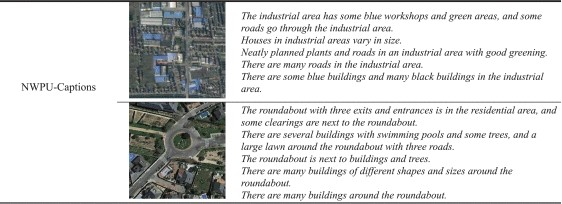

# awesome-remote-image-captioning
The project is currently under construction

### Templates
```markdown
Papers
| [paper name](paper url)<br/>*authors*<br/>> affiliations<br/>> journal year<br/>> tags<br/>> Cited by (cites num)<br/>> [[code](code url)]<br/>> [[demo](demo url)]<br/>> [[page](page url)] | <div align="center"></div><br/>description |

Datasets
| [dataset name](paper url)<br/>> affiliation<br/> >language<br/>> year<br/>>  (categories) categories<br/>> (total images num) images<br/>> resolution | <div align="center"></div><br/>dataset description |

Popular Implementations
| [仓库名称](仓库地址) | [论文名称](论文链接) | 框架 |

Blogs
| [Blog标题](Blog地址) | 作者 | 一句话概括 |
```

### Papers
#### Lite Version
* [**TGRS 2022**] [9] [NWPU-Captions Dataset and MLCA-Net for Remote Sensing Image Captioning](https://ieeexplore.ieee.org/document/9866055) *Cheng et al.*  [[paper]](https://ieeexplore.ieee.org/document/9866055)<br/>
* [**TGRS 2022**] [6] [Remote Sensing Image Change Captioning With Dual-Branch Transformers: A New Method and a Large Scale Dataset](https://ieeexplore.ieee.org/document/9934924) *Liu et al.*  [[paper]](https://ieeexplore.ieee.org/document/9934924)<br/>
* [**TGRS 2022**] [2] [A Joint-Training Two-Stage Method For Remote Sensing Image Captioning](https://ieeexplore.ieee.org/document/9961235) *Ye et al.*  [[paper]](https://ieeexplore.ieee.org/document/9961235)<br/>
* [**TGRS 2022**] [10] [Global Visual Feature and Linguistic State Guided Attention for Remote Sensing Image Captioning](https://ieeexplore.ieee.org/document/9632558) *Zhang et al.*  [[paper]](https://ieeexplore.ieee.org/document/9632558)<br/>
* [**TGRS 2022**] [5] [Change Captioning: A New Paradigm for Multitemporal Remote Sensing Image Analysis](https://ieeexplore.ieee.org/document/9847254) *Hoxha et al.*  [[paper]](https://ieeexplore.ieee.org/document/9847254)<br/>
* [**TGRS 2022**] [15] [Recurrent Attention and Semantic Gate for Remote Sensing Image Captioning](https://ieeexplore.ieee.org/document/9515452) *Li et al.*  [[paper]](https://ieeexplore.ieee.org/document/9515452)<br/>
* [**TGRS 2022**] [40] [High-Resolution Remote Sensing Image Captioning Based on Structured Attention](https://ieeexplore.ieee.org/document/9400386) *Zhao et al.*  [[paper]](https://ieeexplore.ieee.org/document/9400386)<br/>
* [**TGRS 2022**] [22] [A Novel SVM-Based Decoder for Remote Sensing Image Captioning](https://ieeexplore.ieee.org/document/9521989) *Hoxha et al.*  [[paper]](https://ieeexplore.ieee.org/document/9521989)<br/>
* [**ISPRS 2022**] [8] [Meta captioning: A meta learning based remote sensing image captioning framework](https://www.sciencedirect.com/science/article/pii/S0924271622000351) *Qiao et al.*  [[paper]](https://www.sciencedirect.com/science/article/pii/S0924271622000351) [[code]](https://github.com/QiaoqiaoYang/MetaCaptioning)<br/>
* [**ISPRS 2022**] [4] [Generating the captions for remote sensing images: A spatial-channel attention based memory-guided transformer approach](https://www.sciencedirect.com/science/article/pii/S0952197622002317) *Gajbhiye et al.*  [[paper]](https://www.sciencedirect.com/science/article/pii/S0952197622002317) [[code]](https://github.com/GauravGajbhiye/SCAMET_RSIC)<br/>
* [**IJAEOG 2022**] [0] [Multi-label semantic feature fusion for remote sensing image captioning](https://www.sciencedirect.com/science/article/pii/S0303243422000678) *Zia et al.*  [[paper]](https://www.sciencedirect.com/science/article/pii/S0303243422000678)<br/>
* [**TGRS 2021**] [42] [Truncation Cross Entropy Loss for Remote Sensing Image Captioning](https://ieeexplore.ieee.org/document/9153154) *Li et al.*  [[paper]](https://ieeexplore.ieee.org/document/9153154)<br/>
* [**TGRS 2021**] [35] [SD-RSIC: Summarization-Driven Deep Remote Sensing Image Captioning](https://ieeexplore.ieee.org/document/9239371) *Sumbull et al.*  [[paper]](https://ieeexplore.ieee.org/document/9239371)[[code]](https://git.tu-berlin.de/rsim/SD-RSIC)<br/>
* [**TGRS 2021**] [43] [Word–Sentence Framework for Remote Sensing Image Captioning](https://ieeexplore.ieee.org/document/9308980) *Wang et al.*  [[paper]](https://ieeexplore.ieee.org/document/9308980)<br/>
* [**GRSL 2020**] [45] [Denoising-Based Multiscale Feature Fusion for Remote Sensing Image Captioning](https://ieeexplore.ieee.org/abstract/document/9057472) *Huang et al.*  [[paper]](https://ieeexplore.ieee.org/abstract/document/9057472)<br/>
* [**Remote Sensing 2019**] [26] [A Multi-Level Attention Model for Remote Sensing Image Captions](https://www.mdpi.com/2072-4292/12/6/939) *Li et al.*  [[paper]](https://www.mdpi.com/2072-4292/12/6/939)<br/>
* [**TGRS 2019**] [57] [Sound Active Attention Framework for Remote Sensing Image Captioning](https://ieeexplore.ieee.org/abstract/document/8931249) *Lu et al.*  [[paper]](https://ieeexplore.ieee.org/abstract/document/8931249)<br/>
* [**GRSL 2019**] [77] [Semantic Descriptions of High-Resolution Remote Sensing Images](https://ieeexplore.ieee.org/abstract/document/8633358) *Wang et al.*  [[paper]](https://ieeexplore.ieee.org/abstract/document/8633358)<br/>
* [**IEEE Access 2019**] [29] [VAA: Visual Aligning Attention Model for Remote Sensing Image Captioning](https://ieeexplore.ieee.org/abstract/document/8843891) *Zhang et al.*  [[paper]](https://ieeexplore.ieee.org/abstract/document/8843891)<br/>
* [**IGARSS 2019**] [30] [Multi-Scale Cropping Mechanism for Remote Sensing Image Captioning](https://ieeexplore.ieee.org/abstract/document/8900503) *Zhang et al.*  [[paper]](https://ieeexplore.ieee.org/abstract/document/8900503)<br/>
* [**IEEE Access 2019**] [32] [Exploring Multi-Level Attention and Semantic Relationship for Remote Sensing Image Captioning](https://ieeexplore.ieee.org/abstract/document/8943170) *Yuan et al.*  [[paper]](https://ieeexplore.ieee.org/abstract/document/8943170)<br/>
* [**Intelligence Science and Big Data Engineering 2018**] [6] [Intensive Positioning Network for Remote Sensing Image Captioning](https://link.springer.com/chapter/10.1007/978-3-030-02698-1_49) *Wang et al.*  [[paper]](https://link.springer.com/chapter/10.1007/978-3-030-02698-1_49)<br/>
* [**TGRS 2017**] [299] [Exploring Models and Data for Remote Sensing Image Caption Generation](https://ieeexplore.ieee.org/document/8240966) *lu et al.*  [[paper]](https://ieeexplore.ieee.org/document/8240966)<br/>
* [**TGRS 2017**] [142] [Can a Machine Generate Humanlike Language Descriptions for a Remote Sensing Image?](https://ieeexplore.ieee.org/document/7891049) *Shi et al.*  [[paper]](https://ieeexplore.ieee.org/document/7891049)<br/>
* [**CITS 2016**] [145] [Deep semantic understanding of high resolution remote sensing image](https://ieeexplore.ieee.org/abstract/document/7546397) *Qu et al.*  [[paper]](https://ieeexplore.ieee.org/abstract/document/7546397)<br/>

#### Full Version
| Paper info | Description |
|---|---|
| [NWPU-Captions Dataset and MLCA-Net for Remote Sensing Image Captioning](https://ieeexplore.ieee.org/document/9866055/)<br/>*Qimin Cheng; Haiyan Huang; Yuan Xu; Yuzhuo Zhou; Huanying Li; Zhongyuan Wang*<br/>> Huazhong University of Science and Technology<br/>> TGRS 2022<br/>> `Contextual attention`, `NWPU-Captions`<br/>> Cited by 20 | <div align="center"></div><br/>The paper propose a novel encoder–decoder architecture — multilevel and contextual attention network (MLCA-Net), which improves the flexibility and diversity of the generated captions while keeping their accuracy and conciseness.<br/> |
| [Remote Sensing Image Change Captioning With Dual-Branch Transformers: A New Method and a Large Scale Dataset](https://ieeexplore.ieee.org/document/9934924/)<br/>*Chenyang Liu; Rui Zhao; Hao Chen; Zhengxia Zou; Zhenwei Shi*<br/>> Beihang University<br/>> TGRS 2022<br/>> `Change captioning (CC)`, `change detection (CD)`, `Transformer`<br/>> Cited by 19 | <div align="center"></div><br/>The paper proposes a novel Transformer-based RSICC (RSICCformer) model, which consists of a CNN-based feature extractor, a dual-branch Transformer encoder (DTE) and a caption decoder.<br/> |
| [A Joint-Training Two-Stage Method For Remote Sensing Image Captioning](https://ieeexplore.ieee.org/document/9961235/)<br/>*Xiutiao Ye; Shuang Wang; Yu Gu; Jihui Wang; Ruixuan Wang; Biao Hou; Fausto Giunchiglia; Licheng Jiao*<br/>> Xidian University<br/>> TGRS 2022<br/>> `joint training`, `multilabel attributes`<br/>> Cited by 7 | <div align="center"></div><br/>A novel joint-training two-stage (JTTS) method improves remote sensing image captioning by integrating multilabel classification for prior information, utilizing differentiable sampling, and employing an attribute-guided decoder.<br/> |
| [Global Visual Feature and Linguistic State Guided Attention for Remote Sensing Image Captioning](https://ieeexplore.ieee.org/document/9632558/)<br/>*Zhengyuan Zhang;Wenkai Zhang;Menglong Yan;Xin Gao;Kun Fu;Xian Sun*<br/>> Chinese Academy of Sciences<br/>> TGRS 2022<br/>> `Attention mechanism`<br/>> Cited by 25 | <div align="center"></div><br/>This article proposes a global visual feature-guided attention mechanism for remote-sensing image captioning, which introduces global visual features, filters out redundant components.<br/> |
| [Change Captioning: A New Paradigm for Multitemporal Remote Sensing Image Analysis](https://ieeexplore.ieee.org/document/9847254)<br/>*Genc Hoxha;Seloua Chouaf;Farid Melgani;Youcef Smara*<br/>> University of Trento<br/>> TGRS 2022<br/>> `change detection (CD)`, `support vector machines (SVMs)`<br/>> Cited by 13 | <div align="center"></div><br/>This article proposes change captioning systems that generate coherent sentence descriptions of occurred changes in remote sensing, which utilize convolutional neural networks to extract features and recurrent neural networks or support vector machines to generate change descriptions.<br/> |
| [Recurrent Attention and Semantic Gate for Remote Sensing Image Captioning](https://ieeexplore.ieee.org/document/9515452)<br/>*Yunpeng Li;Xiangrong Zhang;Jing Gu;Chen Li;Xin Wang;Xu Tang;Licheng Jiao*<br/>> Xidian University<br/>> TGRS 2022<br/>> `Attention mechanism`, `encoder-decoder`<br/>> Cited by 28 | <div align="center"></div><br/>This article introduces a novel RASG framework for remote sensing image captioning, and it utilizes competitive visual features and a recurrent attention mechanism to generate improved context vectors and enhance word representations.<br/> |
| [High-Resolution Remote Sensing Image Captioning Based on Structured Attention](https://ieeexplore.ieee.org/document/9400386/)<br/>*Rui Zhao;Zhenwei Shi;Zhengxia Zou*<br/>> Beihang University, Beijing<br/>> TGRS 2022<br/>> `structured attention`<br/>> Cited by 59 | <div align="center"></div><br/>A fine-grained, structured attention-based method is proposed for generating language descriptions of high-resolution remote sensing images, utilizes the structural characteristics of semantic contents and can generate pixelwise segmentation masks without requiring pixelwise annotations.<br/> |
| [A Novel SVM-Based Decoder for Remote Sensing Image Captioning](https://ieeexplore.ieee.org/document/9521989/)<br/>*Genc Hoxha;Farid Melgani*<br/>> University of Trento<br/>> TGRS 2022<br/>> `support vector machines (SVMs)`<br/>> Cited by 31 | <div align="center"></div><br/>This article introduces a novel remote sensing image captioning system by using a network of support vector machines (SVMs) instead of recurrent neural networks (RNNs).<br/> |
| [Meta captioning: A meta learning based remote sensing image captioning framework](https://www.sciencedirect.com/science/article/pii/S0924271622000351)<br/>*Qiaoqiao;YangZihao;NiPeng Ren*<br/>> China University of Petroleum (East China)<br/>> ISPRS 2022<br/>> `Meta learning`<br/>> Cited by 8<br/>> [[Code]](https://github.com/QiaoqiaoYang/MetaCaptioning) | <div align="center"></div><br/>The paper presents a meta captioning framework that utilizes meta learning to address the limitations of remote sensing image captioning, transferring meta features extracted from natural image classification and remote sensing image classification tasks to improve captioning performance with a relatively small amount of caption-labeled training data. |
| [Generating the captions for remote sensing images: A spatial-channel attention based memory-guided transformer approach](https://www.sciencedirect.com/science/article/pii/S0952197622002317)<br/>*Gaurav O. Gajbhiye;Abhijeet V. Nandedkar*<br/>> SGGS Institute of Engineering and Technology<br/>> ISPRS 2022<br/>> `Spatial and channel-wise visual attention`, `Transformer`, `Memory guided decoder`<br/>> Cited by 4<br/>> [[Code]](https://github.com/GauravGajbhiye/SCAMET_RSIC) | <div align="center"></div><br/>A novel fully-attentive CNN-Transformer approach is proposed for automatic caption generation in remote sensing images, integrating a multi-attentive visual encoder and a memory-guided Transformer-based linguistic decoder, with a statistical index to measure the model's ability to generate reliable captions across datasets. |
| [Multi-label semantic feature fusion for remote sensing image captioning](https://www.sciencedirect.com/science/article/pii/S0303243422000678)<br/>*Usman ZiaM. Mohsin RiazAbdul Ghafoor*<br/>> National University of Sciences and Technology (NUST), Pakistan<br/>> IJAEOG 2022<br/>> >`Remote sensing image retrieval`,`Multi-modal domains`<br/>> Cited by 0<br/> | <div align="center"></div><br/>This paper proposes a model for generating novel captions for remote sensing images by utilizing multi-scale features and an adaptive attention-based decoder with topic-sensitive word embedding. |
| [Truncation Cross Entropy Loss for Remote Sensing Image Captioning](https://ieeexplore.ieee.org/document/9153154/)<br/>*Xuelong Li;Xueting Zhang;Wei Huang;Qi Wang*<br/>> Northwestern Polytechnical University<br/>> TGRS 2021<br/>> `overfitting`, `truncation cross entropy (TCE) loss`<br/>> Cited by 54 | <div align="center"></div><br/>This article introduces a new approach called truncation cross entropy (TCE) loss to address the overfitting problem in remote sensing image captioning (RSIC), which explores the limitations of cross entropy (CE) loss and proposes TCE loss to alleviate overfitting.<br/> |
| [SD-RSIC: Summarization-Driven Deep Remote Sensing Image Captioning](https://ieeexplore.ieee.org/document/9239371)<br/>*Gencer Sumbul;Sonali Nayak;Begüm Demir*<br/>> Technische Universität Berlin<br/>> TGRS 2021<br/>> `Caption summarization`<br/>> Cited by 35<br/>> [[Code]](https://gitlab.tubit.tu-berlin.de/rsim/SD-RSIC) | <div align="center"></div><br/>The novel SD-RSIC approach addresses the issue of redundant information in remote sensing image captioning, which utilizes summarization techniques, adaptive weighting, and a combination of CNNs and LSTM networks to improve the mapping from the image domain to the language domain.<br/> |
| [Word–Sentence Framework for Remote Sensing Image Captioning](https://ieeexplore.ieee.org/document/9308980/)<br/>*Qi Wang;Wei Huang;Xueting Zhang;Xuelong Li*<br/>> Northwestern Polytechnical University<br/>> TRGS 2021<br/>> `word–sentence framework`<br/>> Cited by 57 | <div align="center"></div><br/>This article introduces a new explainable word-sentence framework for remote sensing image captioning (RSIC), consisting of a word extractor and a sentence generator.<br/> |
| [Denoising-Based Multiscale Feature Fusion for Remote Sensing Image Captioning](https://ieeexplore.ieee.org/abstract/document/9057472)<br/>*Wei Huang; Qi Wang; Xuelong Li*<br/>> Northwestern Polytechnical University<br/>> GRSL 2020<br/>> `encoder–decoder`, `feature fusion`, `multiscale`<br/>> Cited by 50 | <div align="center"></div><br/>This paper proposes a denoising-based multi-scale feature fusion (DMSFF) mechanism for remote sensing image captioning, which improves caption quality by addressing the limitations caused by large-scale variation in remote sensing images. Experimental results on two public datasets validate the effectiveness of the proposed method. |
| [A Multi-Level Attention Model for Remote Sensing Image Captions](https://www.mdpi.com/2072-4292/12/6/939)<br/>Y Li; S Fang; L Jiao; R Liu; R Shang<br/>> Xidian University<br/>> Remote Sensing 2019<br/>> `attention`, `encoder-decoder`<br/>> Cited by 34 | <div align="center"></div><br/>This paper proposes a multi-level attention model for remote sensing image captioning, which mimics human attention mechanisms by incorporating three attention structures for different areas of the image, words, and vision and semantics, achieving superior results compared to previous methods. |
| [Sound Active Attention Framework for Remote Sensing Image Captioning](https://ieeexplore.ieee.org/abstract/document/8931249)<br/>Xiaoqiang Lu; Binqiang Wang; Xiangtao Zheng<br/>> Chinese Academy of Sciences<br/>> TGRS 2019<br/>> `sound activate attention`<br/>> Cited by 65 | <div align="center"></div><br/>It proposes a novel sound active attention framework for more specific caption generation according to the interest of the observer. |
| [Semantic Descriptions of High-Resolution Remote Sensing Images](https://ieeexplore.ieee.org/abstract/document/8633358)<br/>Binqiang Wang; Xiaoqiang Lu; Xiangtao Zheng; Xuelong Li<br/>> University of Chinese Academy of Sciences<br/>> GRSL 2019<br/>> `semantic embedding`, `sentence representation`<br/>> Cited by 88 | <div align="center"></div><br/>This paper proposes a framework that uses semantic embedding to measure the image representation and the sentence representation. |
| [VAA: Visual Aligning Attention Model for Remote Sensing Image Captioning](https://ieeexplore.ieee.org/abstract/document/8843891/authors#authors)<br/>Zhengyuan Zhang; Wenkai Zhang; Wenhui Diao; Menglong Yan; Xin Gao; Xian Sun<br/>> University of Chinese Academy of Sciences<br/>> IEEE Access 2019<br/>> `Visual Aligning Attention Model`<br/>> Cited by 31 | <div align="center"></div><br/>This paper proposes a Visual Aligning Attention model (VAA) and ensures that attention layers accurately focus on regions of interest. |
| [Multi-Scale Cropping Mechanism for Remote Sensing Image Captioning](https://ieeexplore.ieee.org/abstract/document/8900503)<br/>Xueting Zhang; Qi Wang; Shangdong Chen; Xuelong Li<br/>> Northwestern Polytechnical University<br/>> IGARSS 2019<br/>> `multi-scale cropping`<br/>> Cited by 34 | <div align="center"></div><br/>It proposes a training mechanism of multi-scale cropping for remote sensing image captioning in this paper, which can extract more fine-grained information from remote sensing images and enhance the generalization performance of the base model. |
| [Exploring Multi-Level Attention and Semantic Relationship for Remote Sensing Image Captioning](https://ieeexplore.ieee.org/abstract/document/8943170)<br/>*Zhenghang Yuan; Xuelong Li; Qi Wang*<br/>> Northwestern Polytechnical University<br/>> IEEE Access 2019<br/>> `Multi-level attention`, `Graph convolutional networks`<br/>> Cited by 37 | <div align="center"></div><br/>This paper proposes a remote sensing image captioning framework based on multi-level attention and multi-label attribute graph convolution is proposed to improve the performance from two aspects. |
| [Intensive Positioning Network for Remote Sensing Image Captioning](https://link.springer.com/chapter/10.1007/978-3-030-02698-1_49)<br/>*Shengsheng Wang; Jiawei Chen; Guagnyao Wang*<br/>> Jilin University<br/>> Intelligence Science and Big Data Engineering 2018<br/>> `Intensive positioning network (IPN)`<br/>> Cited by 7 | <div align="center"></div><br/>The paper proposes a new network: intensive positioning network (IPN) , which can predict regions containing important information in the picture and output multiple region description blocks around these regions. |
| [Exploring Models and Data for Remote Sensing Image Caption Generation ](https://ieeexplore.ieee.org/document/8240966)<br/>*Xiaoqiang Lu; Binqiang Wang; Xiangtao Zheng; Xuelong Li*<br/>> University of Chinese Academy of Sciences<br/>> TGRS 2017<br/>> `RSICD`<br/>> Cited by 347 | <div align="center"></div><br/>The paper constructs a remote sensing image captioning dataset (RSICD) and evaluates different caption methods based on handcrafted representations and convolutional features on different datasets. |
| [Can a Machine Generate Humanlike Language Descriptions for a Remote Sensing Image?](https://ieeexplore.ieee.org/document/7891049)<br/>*Zhenwei Shi; Zhengxia Zou*<br/>> Beihang University<br/>> TGRS 2017<br/>> `Fully convolutional networks`<br/>> Cited by 154 | <div align="center"></div><br/>The paper investigates an interesting question of can a machine automatically generate humanlike language description of remote sensing image and proposes a remote sensing image captioning framwork, where the experimental results on Google Earth and GF-2 images have demonstrated the superiority and transfer ability of the proposed method. |
| [Deep semantic understanding of high resolution remote sensing image](https://ieeexplore.ieee.org/abstract/document/7546397)<br/>*Bo Qu; Xuelong Li; Dacheng Tao; Xiaoqiang Lu*<br/>> University of the Chinese Academy of Sciences<br/>> CITS 2016<br/>> `HSR image`<br/>> Cited by 169 | <div align="center"></div><br/>This paper proposes a deep multimodal neural network model to solve the problem of understanding HSR remote sensing images in the semantic level and the VGG19-layers network with LSTMs is the best combination for HSR remote sensing image caption generation. |

### Datasets
| Dataset info | Description |
|---|---|
| [NWPU-Captions](https://ieeexplore.ieee.org/document/9866055/)<br/>> Huazhong University of Science and Technology<br/> >English<br/>> 2022<br/>> 45 categories<br/>> 31500 images<br/>> 30 m - 0.2 m | <div align="center"></div><br/>The NWPU-Captions dataset is a larger and more challenging benchmark dataset for remote sensing image captioning, containing 157,500 manually annotated sentences and 31,500 images, offering a greater data volume, category variety, description richness, and wider coverage of complex scenes and vocabulary. |
| [LEVIR-CC](https://ieeexplore.ieee.org/document/9934924/)<br/>> Beihang University<br/> >English<br/>> 2022<br/>> 10 categories<br/>> 10077 images<br/>> 0.5 m - 0.5 m | <div align="center"></div><br/>The LEVIR-CC dataset is a large-scale dataset designed for the RSICC task, consisting of 10077 pairs of RS images and 50385 corresponding sentences describing image differences. |
| [RSICD](https://ieeexplore.ieee.org/document/8240966)<br/>> University of Chinese Academy of Sciences<br/> >English<br/>> 2018<br/>> 30 categories<br/>> 10921 images | <div align="center"></div><br/>It contains more than ten thousands remote sensing images which are collected from Google Earth, Baidu Map, MapABC and Tianditu. |
| [Sydney captions](https://ieeexplore.ieee.org/document/7546397)<br/>> University of the Chinese Academy of Sciences<br/> >English<br/>> 2016<br/>> 7 categories<br/>> 613 images<br/>> 0.5m | <div align="center"></div><br/>It contains 7 different scene categories and totally has 613 HSR images. |
| [UCM captions](https://ieeexplore.ieee.org/document/7546397)<br/>> University of the Chinese Academy of Sciences<br/> >English<br/>> 2016<br/>> 21 categories<br/>> 2100 images<br/>> 0.3048m | <div align="center"></div><br/>It is based on the UC Merced Land Use Dataset and has  2100 HSR images which are divided into 21 challenging scene categories. |

### Popular Implementations
| Code | Paper | Framework |
|---|---|---|
|[a-PyTorch-Tutorial-to-Image-Captioning](https://github.com/sgrvinod/a-PyTorch-Tutorial-to-Image-Captioning) | [Show, Attend and Tell: Neural Image Caption Generation with Visual Attention](https://arxiv.org/abs/1502.03044) | Pytorch |
|[ImageCaptioning.pytorch](https://github.com/ruotianluo/ImageCaptioning.pytorch/tree/master) | [Self-critical Sequence Training for Image Captioning](https://arxiv.org/abs/1612.00563) | Pytorch |
| [stylenet](https://github.com/kacky24/stylenet) | [StyleNet: Generating Attractive Visual Captions with Styles](https://ieeexplore.ieee.org/document/8099591) | Pytorch |
| [image-captioning-bottom-up-top-down](https://github.com/poojahira/image-captioning-bottom-up-top-down/blob/master/README.md) | [Bottom-Up and Top-Down Attention for Image Captioning and Visual Question Answering](https://arxiv.org/abs/1707.07998) | Pytorch |
| [knowing-when-to-look-adaptive-attention](https://github.com/fawazsammani/knowing-when-to-look-adaptive-attention) | [Knowing When to Look: Adaptive Attention via A Visual Sentinel for Image Captioning](https://arxiv.org/abs/1612.01887) | Pytorch |
| [show-control-and-tell](https://github.com/aimagelab/show-control-and-tell) | [Show, Control and Tell: A Framework for Generating Controllable and Grounded Captions](https://arxiv.org/abs/1811.10652) | Pytorch |
| [Multitask_Image_Captioning](https://github.com/andyweizhao/Multitask_Image_Captioning) | [Multitask Learning for Cross-Domain Image Captioning](https://ieeexplore.ieee.org/document/8457273) | Pytorch |
| [NeuralBabyTalk](https://github.com/jiasenlu/NeuralBabyTalk) | [Neural Baby Talk](https://arxiv.org/abs/1803.09845) | Pytorch |
| [Recurrent_Fusion_Network](https://github.com/cswhjiang/Recurrent_Fusion_Network) | [Recurrent Fusion Network for Image Captioning](https://arxiv.org/abs/1807.09986) | Pytorch |
| [Stack-Captioning](https://github.com/gujiuxiang/Stack-Captioning) | [Stack-Captioning: Coarse-to-Fine Learning for Image Captioning](https://arxiv.org/abs/1709.03376) | Pytorch |
| [image_captioning](https://github.com/DeepRNN/image_captioning) | [Show, Attend and Tell: Neural Image Caption Generation with Visual Attention](https://arxiv.org/abs/1502.03044) | Tensorflow |
| [densecap](https://github.com/jcjohnson/densecap) | [DenseCap: Fully Convolutional Localization Networks for Dense Captioning](https://arxiv.org/abs/1511.07571) | Torch |
| [AdaptiveAttention](https://github.com/jiasenlu/AdaptiveAttention) | [Knowing When to Look: Adaptive Attention via A Visual Sentinel for Image Captioning](https://arxiv.org/abs/1612.01887) | Torch |

### Benchmarks

DataSet: [UCM-CAPTIONS](https://ieeexplore.ieee.org/document/7546397)
|　Method  | Year | BLEU-1  | BLEU-2 | BLEU-3 | BLEU-4 | METEOR | ROUGE  |CIDEr | SPICE |
 |------ | ------- | ------ | ------ | ------ | ------ | ------ | ---- | ----- | ----- |
|[VLAD-LSTM](https://ieeexplore.ieee.org/document/8240966) |2018|0.7016|0.6085|0.5496|0.5030|0.3464|0.6520|2.3131| --
|[SIFT-LSTM](https://ieeexplore.ieee.org/document/8240966) |2018|0.5517|0.4166|0.3489|0.3040|0.2432|0.5235|1.3603| --
|[PCSMLF](https://ieeexplore.ieee.org/stamp/stamp.jsp?tp=&arnumber=8633358) |2019|0.4361|0.2728|0.1855|0.1210|0.1320|0.3927|0.2227| --
|[FC-ATT+LSTM](https://www.mdpi.com/2072-4292/11/6/612) |2019 |0.8135|0.7502|0.6849|0.6352|0.4173|0.7504|2.9958| --
|[SM-ATT+LSTM](https://www.mdpi.com/2072-4292/11/6/612) |2019 |0.8154|0.7575|0.6936|0.6458|0.4240|0.7632|3.1864|  --
|[Soft Attention](https://ieeexplore.ieee.org/document/8240966)|2019|0.7454|0.6545|0.5855|0.5250|0.3886|0.7237|2.6124| -- 
|[Hard Attention](https://ieeexplore.ieee.org/document/8240966)|2019|0.8157|0.7312|0.6702|0.6182|0.4263|0.7698|2.9947| --
|[Sound-a-a](https://ieeexplore.ieee.org/document/8931249)   |2020|0.7484|0.6837|0.6310|0.5896|0.3623|0.6579|2.7281|0.3907
|[SAT(LAM)](https://www.mdpi.com/2072-4292/11/20/2349)  |2019|0.8195|0.7764|0.7485|0.7161|0.4837|0.7908|3.6171|0.5024
|[ADAPTIVE(LAM)](https://www.mdpi.com/2072-4292/11/20/2349)  |2019|0.8170|0.7510|0.6990|0.6540|0.4480|0.7870|3.2800|0.5030
|[TCE loss-based](https://ieeexplore.ieee.org/document/9153154)|2020|0.8210|0.7622|0.7140|0.6700|0.4775|0.7567|2.8547| --
|[Recurrent-ATT](https://ieeexplore.ieee.org/document/9515452)|2021|0.8518|0.7925|0.7432|0.6976|0.4571|0.8072|3.3887|0.4891
|[GVFGA+LSGA](https://ieeexplore.ieee.org/document/9632558)  |2022|0.8319|0.7657|0.7103|0.6596|0.4436|0.7845|3.3270|0.4853
|[SVM-D BOW](https://ieeexplore.ieee.org/document/9521989)  |2022|0.7635|0.6664|0.5869|0.5195|0.3654|0.6877|2.7142| --
|[SVM-D CONC](https://ieeexplore.ieee.org/document/9521989) |2022|0.7653|0.6947|0.6417|0.5942|0.3702|0.6877|2.9228| --
|[MLCA-Net](https://ieeexplore.ieee.org/document/9521989) |2022|0.8260|0.770|0.7170|0.6680|0.4350|0.7720|3.240|0.4730
|[Structured attention](https://ieeexplore.ieee.org/document/9400386)|2022|0.8538|0.8035|0.7572|0.7149|0.4632|0.8141|3.3489| --
|[AJJTTSM](https://ieeexplore.ieee.org/document/9961235)    |2022|**0.8696**|**0.8224**|**0.7788**|**0.7376**|**0.4906**|**0.8364**|**3.7102**|**0.5231**| --
---

DataSet: [SYDNEY-CAPTIONS](https://ieeexplore.ieee.org/document/7546397)
|Method  | Year | BLEU-1  | BLEU-2 | BLEU-3 | BLEU-4 | METEOR | ROUGE  |CIDEr | SPICE |
 |------ | ------- | ------ | ------ | ------ | ------ | ------ | ---- | ----- | ----- |
|[VLAD-LSTM](https://ieeexplore.ieee.org/document/8240966) |2018|0.4913|0.3472|0.2760|0.2314|0.1930|0.4201|0.9164| --
|[SIFT-LSTM](https://ieeexplore.ieee.org/document/8240966) |2018|0.5793|0.4774|0.4183|0.3740|0.2707|0.5366|0.9873| --
|[CSMLF](https://ieeexplore.ieee.org/stamp/stamp.jsp?tp=&arnumber=8633358) |2019|0.5998|0.4583|0.3869|0.3433|0.2475|0.5018|0.9378| --
|[FC-ATT+LSTM](https://www.mdpi.com/2072-4292/11/6/612)            |2019|0.8076|0.7160|0.6276|0.5544|0.4099|0.7114|2.2033| --
|[SM-ATT+LSTM](https://www.mdpi.com/2072-4292/11/6/612)            |2019|0.8143|0.7351|0.6586|0.5806|0.4111|0.7195|2.3021| --
|[Soft Attention](https://ieeexplore.ieee.org/document/8240966)    |2019|0.7322|0.6674|0.6223|0.5820|0.3942|0.7127|2.4993| -- 
|[Hard Attention](https://ieeexplore.ieee.org/document/8240966)    |2019|0.7591|0.6610|0.5889|0.5258|0.3898|0.7189|2.1819| --
|[Sound-a-a](https://ieeexplore.ieee.org/document/8931249)         |2020|0.7093|0.6228|0.5393|0.4602|0.3121|0.5974|1.7477|0.3837
|[SAT(LAM)](https://www.mdpi.com/2072-4292/11/20/2349)             |2019|0.7405|0.6550|0.5904|0.5304|0.3689|0.6814|2.3519|0.4038
|[ADAPTIVE(LAM)](https://www.mdpi.com/2072-4292/11/20/2349)        |2019|0.7323|0.6316|0.5629|0.5074|0.3613|0.6775|2.3455|0.4243
|[TCE loss-based](https://ieeexplore.ieee.org/document/9153154)    |2020|0.7937|0.7304|0.6717|0.6193|0.4430|0.7130|2.4042| --
|[Recurrent-ATT](https://ieeexplore.ieee.org/document/9515452)     |2021|0.8000|0.7217|0.6531|0.5909|0.3908|0.7218|2.6311|0.4301
|[GVFGA+LSGA](https://ieeexplore.ieee.org/document/9632558)        |2022|0.7681|0.6846|0.6145|0.5504|0.3866|0.7030|2.4522|0.4532
|[SVM-D BOW](https://ieeexplore.ieee.org/document/9521989)         |2022|0.7787|0.6835|0.6023|0.5305|0.3797|0.6992|2.2722| --
|[SVM-D CONC](https://ieeexplore.ieee.org/document/9521989)        |2022|0.7547|0.6711|0.5970|0.5308|0.3643|0.6746|2.2222| --
|[MLCA-Net](https://ieeexplore.ieee.org/document/9521989)          |2022|0.8310|0.7420|0.6590|0.5800|0.3900|0.7110|2.3240|0.4090
|[Structured attention](https://ieeexplore.ieee.org/document/9400386)|2022|0.7795|0.7019|0.6392|0.5861|0.3954|0.7299|2.3791| --
|[AJJTTSM](https://ieeexplore.ieee.org/document/9961235)    |2022|**0.8492**|**0.7797**|**0.7137**|**0.6496**|**0.4457**|**0.7660**|**2.8010**|**0.4679**| --
---
DataSet: [RSICD](https://ieeexplore.ieee.org/document/8240966)
|Method  | Year | BLEU-1  | BLEU-2 | BLEU-3 | BLEU-4 | METEOR | ROUGE  |CIDEr | SPICE |
 |------ | ------- | ------ | ------ | ------ | ------ | ------ | ---- | ----- | ----- |
|[VLAD-LSTM](https://ieeexplore.ieee.org/document/8240966) |2018|0.5004|0.3195|0.2319|0.1778|0.2046|0.4334|1.1801| --
|[SIFT-LSTM](https://ieeexplore.ieee.org/document/8240966) |2018|0.4859|0.3033|0.2186|0.1678|0.1966|0.4174|1.0528| --
|[CSMLF](https://ieeexplore.ieee.org/stamp/stamp.jsp?tp=&arnumber=8633358) |2019|0.5759|0.3959|0.2832|0.2217|0.2128|0.4455|0.5297| --
|[FC-ATT+LSTM](https://www.mdpi.com/2072-4292/11/6/612)            |2019|0.7459|0.6250|0.5338|0.4574|0.3395|0.6333|2.3664| --
|[SM-ATT+LSTM](https://www.mdpi.com/2072-4292/11/6/612)            |2019|0.7571|0.6336|0.5385|0.4612|0.3513|0.6458|2.3563| --
|[Soft Attention](https://ieeexplore.ieee.org/document/8240966)    |2019|0.6753|0.5308|0.4333|0.3617|0.3255|0.6109|1.9643| -- 
|[Hard Attention](https://ieeexplore.ieee.org/document/8240966)    |2019|0.6669|0.5182|0.4164|0.3407|0.3201|0.6084|1.7925| --
|[Sound-a-a](https://ieeexplore.ieee.org/document/8931249)         |2020|0.6196|0.4819|0.3902|0.3195|0.2733|0.5143|1.6386|0.3598
|[SAT(LAM)](https://www.mdpi.com/2072-4292/11/20/2349)             |2019|0.6753|0.5537|0.4686|0.4026|0.3254|0.5823|2.5850|0.4636
|[ADAPTIVE(LAM)](https://www.mdpi.com/2072-4292/11/20/2349)        |2019|0.6664|0.5486|0.4676|0.4070|0.3230|0.5843|2.6055|0.4673
|[TCE loss-based](https://ieeexplore.ieee.org/document/9153154)    |2020|0.7608|0.6358|0.5471|0.4791|0.3425|0.6687|2. 4665| --
|[Recurrent-ATT](https://ieeexplore.ieee.org/document/9515452)     |2021|0.7729|0.6651|0.5782|0.5062|0.3626|0.6691|2.7549|0.4719
|[GVFGA+LSGA](https://ieeexplore.ieee.org/document/9632558)        |2022|0.6779|0.5600|0.4781|0.4165|0.3285|0.5929|2.6012|0.4683
|[SVM-D BOW](https://ieeexplore.ieee.org/document/9521989)         |2022|0.6112|0.4277|0.3153|0.2411|0.2303|0.4588|0.6825| --
|[SVM-D CONC](https://ieeexplore.ieee.org/document/9521989)        |2022|0.5999|0.4347|0.3550|0.2689|0.2299|0.4557|0.6854| --
|[MLCA-Net](https://ieeexplore.ieee.org/document/9521989)          |2022|0.7500|0.6310|0.5380|0.4590|0.3420|0.6380|2.4180|0.4440
|[Structured attention](https://ieeexplore.ieee.org/document/9400386)|2022|0.7016|0.5614|0.4648|0.3934|0.3291|0.5706|1.7031| --
|[AJJTTSM](https://ieeexplore.ieee.org/document/9961235)    |2022|**0.7893**|**0.6795**|**0.5893**|**0.5135**|**0.3773**|**0.6823**|**2.7958**|**0.4877**| --
---

DataSet: [NWPU-CAPTIONS](https://ieeexplore.ieee.org/document/9866055/)
| metrics | sota | method | paper |
| --- | --- | --- | --- |
| BLEU-1 | 0.745 | MLCA-Net | [NWPU-Captions Dataset and MLCA-Net for Remote Sensing Image Captioning](https://ieeexplore.ieee.org/document/9866055) |
| BLEU-2 | 0.624 | MLCA-Net | [NWPU-Captions Dataset and MLCA-Net for Remote Sensing Image Captioning](https://ieeexplore.ieee.org/document/9866055) |
| BLEU-3 | 0.541 | MLCA-Net | [NWPU-Captions Dataset and MLCA-Net for Remote Sensing Image Captioning](https://ieeexplore.ieee.org/document/9866055) |
| BLEU-4 | 0.478 | MLCA-Net | [NWPU-Captions Dataset and MLCA-Net for Remote Sensing Image Captioning](https://ieeexplore.ieee.org/document/9866055) |
| METEOR | 0.337 | MLCA-Net | [NWPU-Captions Dataset and MLCA-Net for Remote Sensing Image Captioning](https://ieeexplore.ieee.org/document/9866055) |
| ROUGE | 0.601 | MLCA-Net | [NWPU-Captions Dataset and MLCA-Net for Remote Sensing Image Captioning](https://ieeexplore.ieee.org/document/9866055) |
| CIDEr | 1.264 | MLCA-Net | [NWPU-Captions Dataset and MLCA-Net for Remote Sensing Image Captioning](https://ieeexplore.ieee.org/document/9866055) |
---
DataSet: [LEVIR-CC](https://ieeexplore.ieee.org/document/9934924/)
| metrics | sota | method | paper |
| --- | --- | --- | --- |
| BLEU-1 | 0.8481 | RSICCformer | [Remote Sensing Image Change Captioning With Dual-Branch Transformers: A New Method and a Large Scale Dataset](https://ieeexplore.ieee.org/document/9934924) |
| BLEU-2 | 0.7639 | RSICCformer | [Remote Sensing Image Change Captioning With Dual-Branch Transformers: A New Method and a Large Scale Dataset](https://ieeexplore.ieee.org/document/9934924) |
| BLEU-3 | 0.6914 | RSICCformer | [Remote Sensing Image Change Captioning With Dual-Branch Transformers: A New Method and a Large Scale Dataset](https://ieeexplore.ieee.org/document/9934924) |
| BLEU-4 | 0.6307 | RSICCformer | [Remote Sensing Image Change Captioning With Dual-Branch Transformers: A New Method and a Large Scale Dataset](https://ieeexplore.ieee.org/document/9934924) |
| METEOR | 0.3961 | RSICCformer | [Remote Sensing Image Change Captioning With Dual-Branch Transformers: A New Method and a Large Scale Dataset](https://ieeexplore.ieee.org/document/9934924) |
| ROUGE | 0.7418 | RSICCformer | [Remote Sensing Image Change Captioning With Dual-Branch Transformers: A New Method and a Large Scale Dataset](https://ieeexplore.ieee.org/document/9934924) |
| CIDEr | 1.3468 | RSICCformer | [Remote Sensing Image Change Captioning With Dual-Branch Transformers: A New Method and a Large Scale Dataset](https://ieeexplore.ieee.org/document/9934924) |


### Blogs
| Title | Author | Overview |
|---|---|---|
| [illustrated-transformer](http://jalammar.github.io/illustrated-transformer/) | [Jay Alammar](http://jalammar.github.io/) | Visualize the principle of the Transformer |
| [visualizing-neural-machine-translation-mechanics-of-seq2seq-models-with-attention](https://jalammar.github.io/visualizing-neural-machine-translation-mechanics-of-seq2seq-models-with-attention/) | [Jay Alammar](http://jalammar.github.io/) | Visualize the principle of the Machine Translation |
